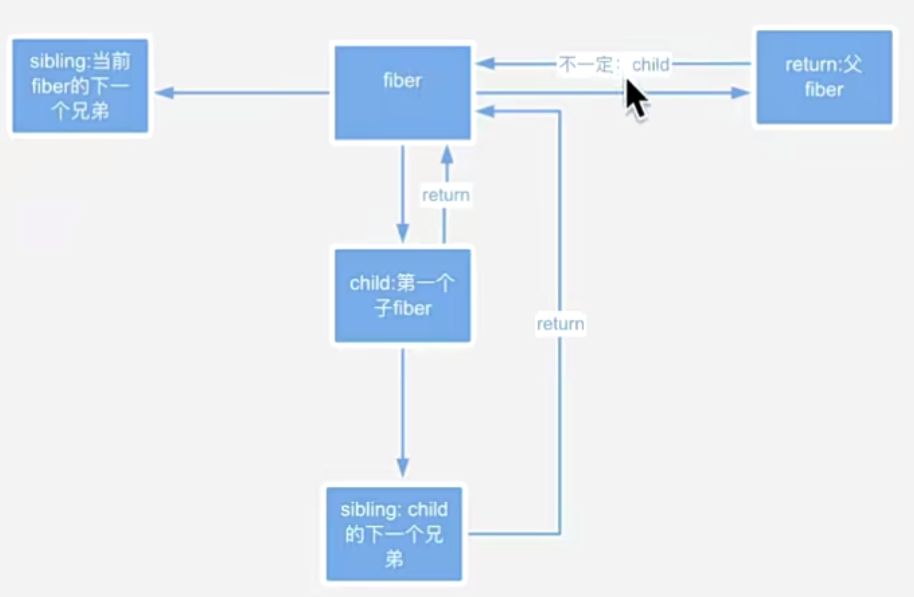
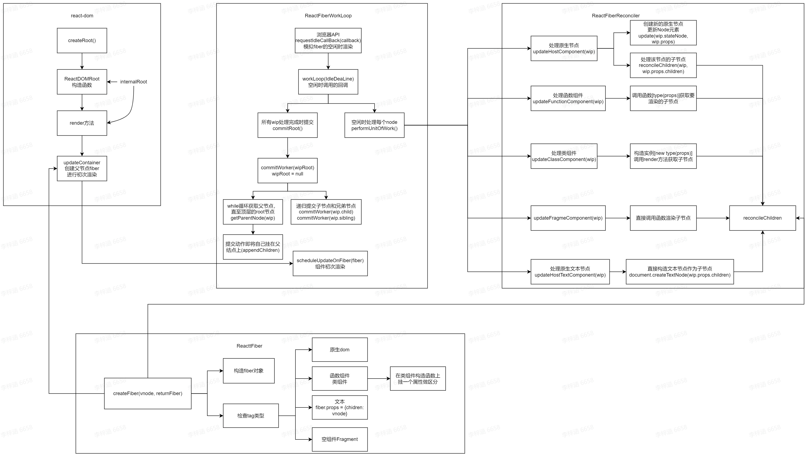
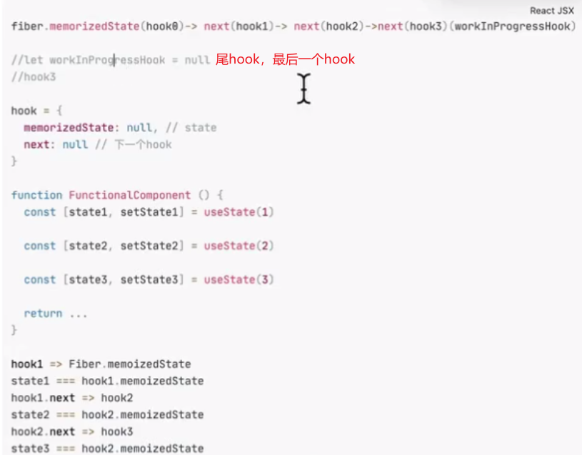
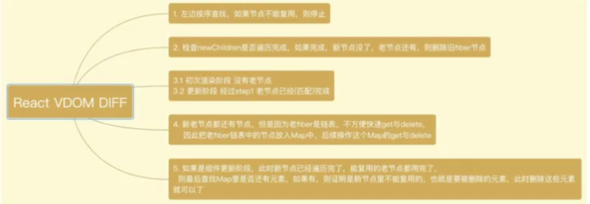
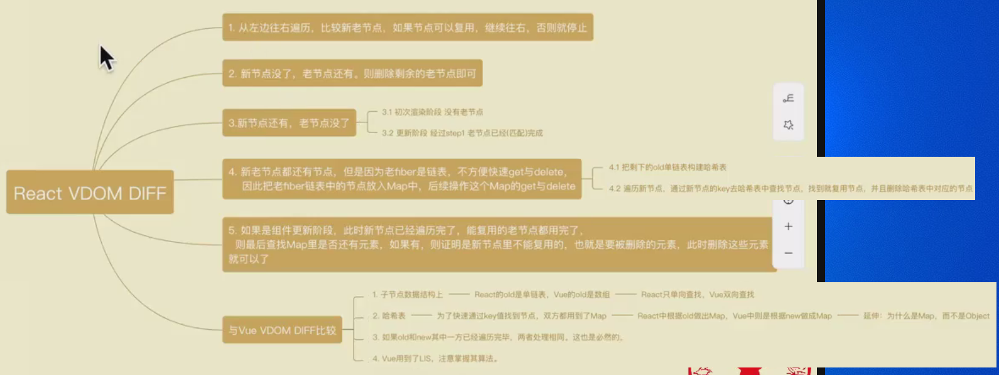
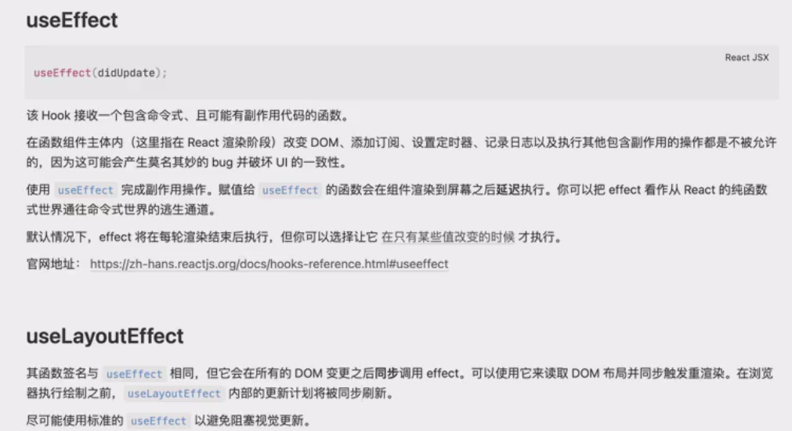

flags定义为二进制，而不是字符串或单个数字，一方面是因为二进制单个数字具有唯一性，某个范围内的组合同样具有唯一性；另一方面在于简洁方便，且速度快
```js
/*utils.js*/
export const NoFlags = /*                      */ 0b000000000000000000000000;

export const Placement = /*                    */ 0b000000000000000000000010;
export const Update = /*                       */ 0b000000000000000000000100;
export const ChildDeletion = /*                */ 0b00000000000000000000001000;
export const ContentReset = /*                 */ 0b00000000000000000000010000;

// These are not really side effects, but we still reuse this field.
export const Incomplete = /*                   */ 0b00000000000100000000000000;
export const Forked = /*                       */ 0b00000010000000000000000000;
```

1. 定义fiber节点 --- ReactFibers.js
    1. 类型:tag type stateNode
    2. 属性(props)
    3. 子节点(child) 父节点(return) 兄弟节点(silbing) 当前层级的位置(index)
2. 执行任务 --- ReactWorkLoop.js  
    1. 更新当前组件 <--- ReactReconciler.js
    2. 下一个更新谁 <--- 深度优先遍历 
3. 初次渲染
    + `ReactDOM.render(<App />, document.getElementById("root"))`背后生成一个root对象,多次复用时会创建多个root对象
    ---> 
    `ReactDOM.createRoot(document.getElementById("root")).render(<App />)`createRoot将root对象暴露给用户进行使用,避免多次使用的浪费; 
    1. createRoot返回一个对象,对象上面有一个render方法
    2. render也需要拿到root ---> 将这个root挂在createRoot返回的对象上
4. 实现原生节点的初次渲染
    1. 调用浏览器API---requestIdleCallback(callback, [options])
    2. 实现该API的回调函数workLoop(IdleDeaLine), IdleDeaLine中有线程空闲时间timeRemaining
        1. 在浏览器空闲时间`IdleDeaLine.timeRemaining > 0`执行函数performUnitOfWork来处理任务
        2. 全部渲染完成后进行提交`commitRoot()`
    3. 实现`updateHostComponent()`处理原生标签 
        1. 新建一个原生节点
        2. 处理子节点fiber管旭`reconcilerChildren(wip, wip.props.children)`
            + 字符串或数字 --- return 即可
            + 字符串或对象, 包裹一下直接挂children
    4. commitRoot利用commitWorker实现
        + commitWorker提交自身Node的更新 子节点更新 兄弟节点更新 
5. 实现函数组件的初次渲染（只关注return的节点内容，后续在关注hooks等等）
    1. 获取父节点问题：直接父节点是Function，需要while循环获取第一个原生dom父节点
    2. 渲染内部节点问题：利用type属性得到执行函数，props属性得到传参，执行函数得到渲染的组件内容，调用reconcileChildren渲染即可
6. 实现类组件的初次渲染（类似函数组件）
    1. 区分函数组件和类组件问题：因为类组件是继承得来的，在原型上加上isReactComponent属性
    2. 渲染内部节点：类组件由render函数进行，只需实例化后调用render函数即可得到对应的内部组件
7. 实现文本节点的初次渲染
    1. 判断并挂tag：文本节点的type为undefined
    2. 构建fiber时同时需要将传入的vnode挂到props.children上
8. 实现空组件(Fragment)的初次渲染
    1. 判断并挂tag：
    2. 直接调用reconcileChildren渲染子节点即可




# 实现简版Scheduler
## 实现该场景下的最小堆
1. 返回堆顶元素 --- peek(heap) --- return heap[0];
2. 插入元素 --- push(heap, node)
    1. 放入数组尾部
    2. 向上调整最小堆 --- siftUp(heap, node, index) --- 从index向上调整node
        1. 父节点下标 = (子节点下标 - 1) / 2 = (子节点下标 - 1) >> 1
        2. 比较函数compare(parent, node) --- 先比较优先级，相同时再比较id
        3. 交换
3. 删除堆顶元素 --- pop(heap)
    1. 用数组尾部元素覆盖heap[0]
    2. 向下调整最小堆 --- siftDown(heap, last, 0)
        1. 左子节点下标 = (父节点下标 + 1) * 2 - 1；
           右子节点下标 = 左子节点下标 + 1
        2. 比较并交换
            + left < node
                + right < left 交换right和node
                + 交换left和node
            + right < node
                + right < left 交换right和node
            + return
## 实现简版Scheduler
1. 构造暴露在外的SchedulerCallback函数
    + 构造任务对象newTask
    + push进任务队列
    + 请求调度requestHostCallback()
    + 利用MessageChannel API实现调度请求
    port通知port2开启wookLoop
2. 在初次渲染和更新的函数scheduleUpdateOnFiber中调用scheduleCallback(wookLoop)

# Hook解决了什么问题
## 组件之间复用逻辑状态难
render props 和告诫组件需要重新组织组件结构
hook可以在不修改组件结构的情况下复用状态逻辑
## 复杂组件难以理解
componentDidMount只有一个，逻辑复杂时很臃肿；setState也只有一个
hook将组件中相互关联的部分拆成更小的函数
## 难以理解的class
class中的this经常undefined，需要bind一下
class不能很好的压缩，会使热重载出现不稳定的情况

# Hook原理 --- 单链表


# useReducer
useState的替代方案，接受形如`(state, dispatch) => newState`的reducer，并返回当前的state以及与其配套的dispatch方法。
+ state逻辑复杂且包含多个子值， 或者下一个state依赖于之前的state
+ 使用useReducer能给会触发深更新的组件做性能优化，因为可以向子组件传递dispatch而不是回调函数
## 简单实现
1. 在utils.js中增加对事件的监听 --- 简版
2. 新建hooks.js文件简单实现useReducer
```js
/**
 * 1. 状态值和hook等挂在哪里？ --- 函数组件的fiber上 --- 怎么获取当前的fiber --- 涉及到workLoop文件
 * 2. 获取当前正要渲染的hook
 *  1.拿到当前的hook: current = currentlyRenderingFiber.alternate;
 *    workInProgressHook指向当前正处理的hook，初始为null
 *    + current空为初次渲染---初始化hook
 *      1. 定义hook对象(memorizedState + next)
 *      2. workInProgressHook为空，则为hook0，挂在currentlyRenderingFiber.memorizedState上
 *      3. workInProgressHook非空，挂在workInProgressHook.next上
 *    + current非空为组件更新---按顺序找下一个hook
 *      1.初始化 正要更新的fiber 上的hook0为当前fiber的fiber0
 *      2. workInProgressHook为空，则将当前工作hook和要返回的hook都指向currentlyRenderingFiber.memorizedState
 *      3. workInProgressHook非空，则都指向next
 * 3. 判断是不是初次渲染 --- currentlyRenderingFiber.alternate
 *      初次渲染传入initalState
 * 4. dispatch执行传入的回调函数
 *  1. 更新hook上的memorizedState
 *  2. 更新fiber节点上的alternate
 *  3. 调用scheduleUpdateOnFiber(currentlyRenderingFiber)从当前节点开始更新
 *  4. 返回[hook.memorizedState, dispatch]
 */
```
3. 完成更新函数组件的部分
    1. diff协调，vDOM层级更新fiber
        + 节点复用的条件：1. 同一层级下 2. 类型相同 3. key相同
        + 使用Object.assign(newFiber, {})做属性的合并与复用，主要是
        ```js
        Object.assign(newFiber, {
            stateNode: oldFiber.stateNode,
            alternate: oldFiber,
            flags: Update,
        })
        ```
    2. 提交阶段，DOM层级更新 --- updataNode(node, prevVal, nextVal) --- 简单做一个旧属性prevVal的卸载与清除，再做一个新属性的挂载

# useState
## 完善useReducer
currentlyRenderingFiber为全局变量，且只会在当第一次渲染时改变，因此在更新时永远指向最后一个渲染的函数组件。这就导致，最后一个函数组件之前的所有函数组件都不会被更新。
解决：修改dispatch，在渲染时就将当前的fiber、hook、reducer与dispatch绑定
```js
export function useReducer(reducer, initalState) {
  ...
  const dispatch = dispatchReducerAction.bind(
    null,
    currentlyRenderingFiber,
    hook,
    reducer
  );

  return [hook.memorizedState, dispatch];
}
function dispatchReducerAction(fiber, hook, reducer, action){
    hook.memorizedState = reducer ? reducer(hook.memorizedState) : action
    fiber.alternate = { ...fiber };
    fiber.sibling = null;
    scheduleUpdateOnFiber(fiber);
}
```
## 利用useReducer的dispatch实现useState
```js
export function useState(initalState) {
  return useReducer(null, initalState);
}
```

# 实现删除节点
1. 在需要删除节点的父fiber上新增一个deletions数组属性，用来记录要删除的fiber
2. 在提交commit时遍历deletions数组，进行removeChild
## 删除老节点( 0 1 2 3 4 --- 0 5 2)
1. 在之前的删除中，只处理到全部有更新的节点，后续的老节点不会涉及，因此在之前的删除中可以拿到的是第一个没处理的老节点oldFiber
2. 实现删除老节点的函数`deleteRemainingChildren(returnFiber, currentFirstChild)` --- 循环调用`deleteChild()`即可

# 真正的React VDOM Diff


## 初次渲染
0. 初次渲染分为两种情况：
    + 真正的第一次进来，第一次渲染
    + 更新时老节点都没了，只有新节点
1. 新增变量：
    + shouldTrackSideEffects = !! returnFiber.alternate 用于判断returnFiber是初次渲染还是更新
    + lastPlacedIndex = 0 上一次插入节点的位置 --- 用来判断更新时节点是否移动
    + 启用fiber节点的index属性，记录节点在链表中的位置
2. 实现放置子节点位置的函数PlacedChild的初次渲染部分，即给fiber.index赋初始值
## 更新fiber
**聚焦于reconcileChildren(returnFiber, children)，即触发函数组件更新时对子组件的diff协调过程**
整体遵循上图的过程：
1. 从左向右比较新旧节点链表，相同节点复用，否则结束本次循环 --- 0 1 2 3 4 5 --> 0 1 | 3 4 5 6
2. 新节点链表走完，就将剩余旧节点加入删除数组 --- 0 1 2 3 --> 0 1
3. 旧节点链表走完，就渲染每个剩下的新节点，加入到函数组件上 --- 0 1 2 --> 0 1 2 | 3 4
4. 新旧都没走完，但是后面的不一样了。将旧节点剩余部分构造成哈希表(Map)，将新节点链表中剩余部分与哈希表逐个对比，哈希表中存在就复用，同时更新fiber.index，并在哈希表中删除该节点 --- 0 1 2 [3 4 5] --> 0 1 | 3 4
5. 4中构造的哈希表中还有值，这说明有旧节点不需要了，加入到函数fiber的删除数组中即可。
## 更新DOM层
1 2 3 4 --> 2 1 3 4
对于如上情况，我们看做是1在移动，因为2直接节点复用渲染了(lastPlacedIndex变量部分判断逻辑)
PS: 此时fiber的顺序是对的，但由于节点1的flag是Placement，因此提交时走appendChild分支，所以缀在最后面。
对于此，解决方法是找到[2 1 3 4]中在1后面的节点，即3，用insertBefore(node, beforeNode)方法插入到找到的节点前面。
改造commitWorker方法中Placement分支部分：
1. 找到走到该分支fiber节点的下一个节点
2. 如果能找到，证明该节点是移动位置的节点，插入到找到节点的前面
3. 如果为null，则说明是真正的Placement，直接appendChild即可

# useEffect和useLayoutEffect

`useEffect(() => {}, 依赖项)`即useEffect是否执行、调用回调依赖于第二个参数，useLayoutEffect类似
1. fiber上挂effect数组 --- hook.js
**源码中effect和layoutEffect使用一个单链表存储，并挂载在fiber上**
此处简单处理，将effect和layoutEffect用两个数组分别存储，并挂载fiber上。utils.js中新增两个flag用于区分。
hook.memorizedState存储state或effect
2. 在提交时执行回调 --- ReactWookLoop.js
在提交时，遍历传入commit函数的wip上的两个数组。其中layoutEffect对应的数组同步执行，直接调用回调即可；而effect对应的数组异步执行，放在scheduleCallback中执行。
3. 比较依赖项 --- utils.js and ReactWookLoop.js
遍历比较即可，利用`Object.is()`

# 自定义hook遇到的问题
1. App组件调用useCounter，这个Hook调用useInterval来每秒更新一次计数器。但是App组件也调用useInterval每两秒随机更新一次页面背景色。更新页面背景色的回调函数因为一些原因从未执行过。
原因：delay小的useInterval执行阻塞了delay大的useInterval执行回调函数
解决：使用experimental_useEffectEvent包裹回调函数，使其不用成为useEffect的依赖项，这样Effect不会同步更新
https://zh-hans.react.dev/learn/reusing-logic-with-custom-hooks

```js
/*在useInterval内部把tick回调函数包裹进一个EffectEvent。这将让你可以从Effect的依赖项中删掉onTick。每次组件重新渲染时，Effect将不会重新同步，所以页面背景颜色变化interval有机会触发之前不会每秒重置一次。随着这个修改，两个interval都会像预期一样工作并且不会互相干扰：*/
import { useEffect } from 'react';
import { experimental_useEffectEvent as useEffectEvent } from 'react';

export function useInterval(callback, delay) {
  const onTick = useEffectEvent(callback);
  useEffect(() => {
    const id = setInterval(onTick, delay);
    return () => clearInterval(id);
  }, [delay]);
}

```